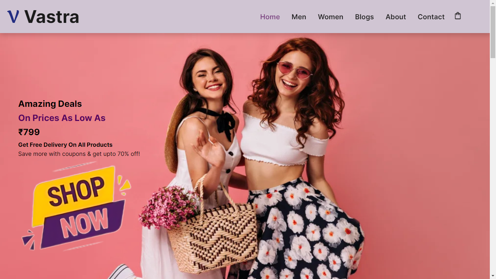
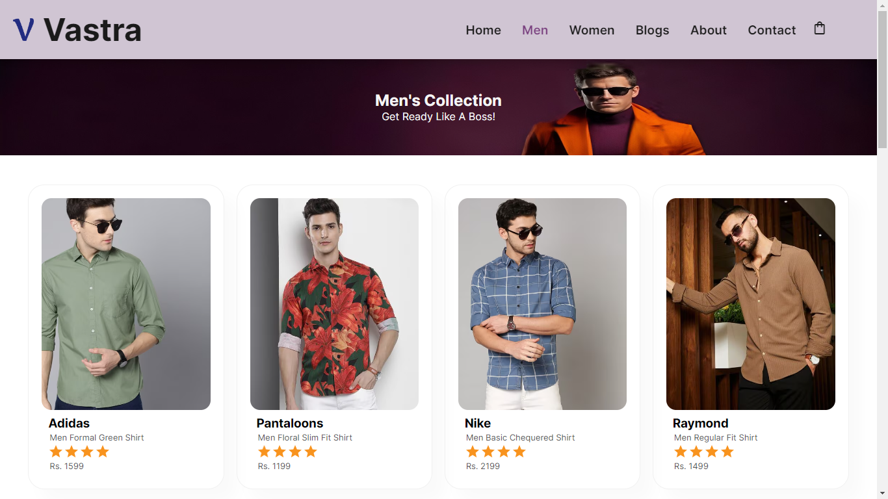
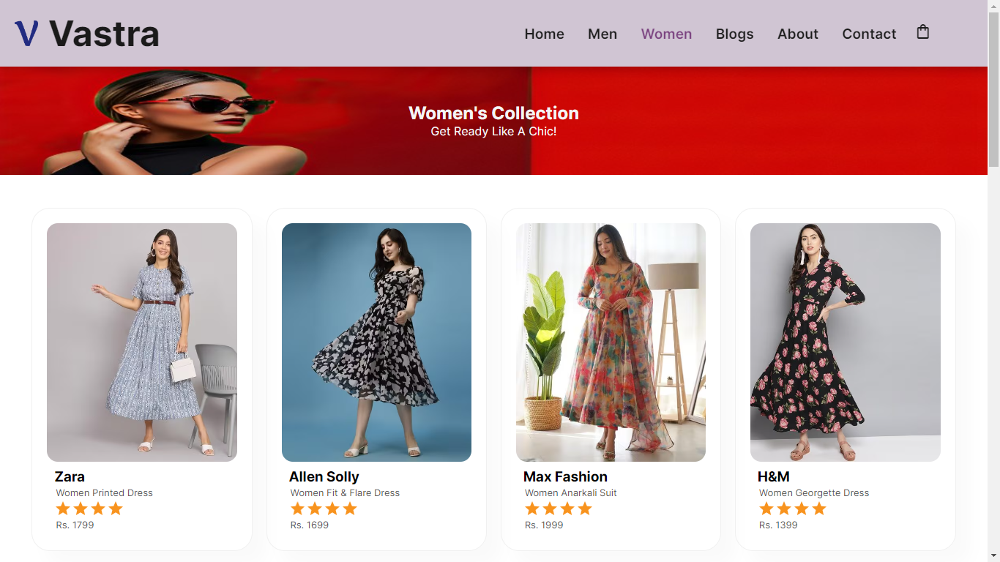
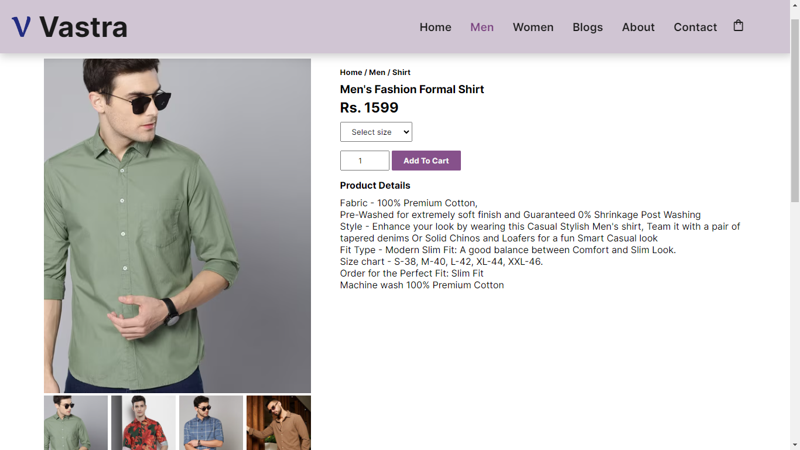
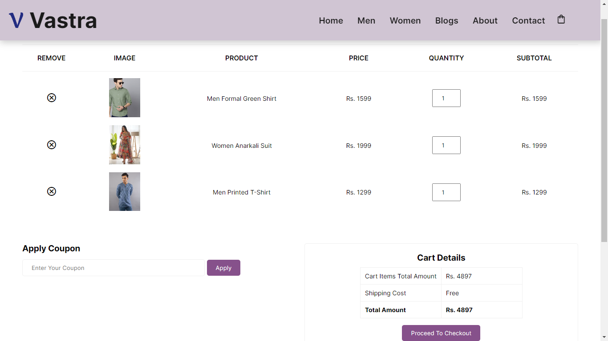

# 👗 Vastra – Clothing E-Commerce Website

[](https://mohitaggarwal1.github.io/Vastra/)




🔗 **Live Website:** [https://mohitaggarwal1.github.io/Vastra/](https://mohitaggarwal1.github.io/Vastra/)  
📸 **Instagram:** [https://www.instagram.com/mohhitaggarwal](https://www.instagram.com/mohhitaggarwal)  
💼 **LinkedIn:** [https://www.linkedin.com/in/mohitaggarwalofficial](https://www.linkedin.com/in/mohitaggarwalofficial)

---

# 📌 Project Overview

**Vastra** is a fully responsive **fashion e-commerce website** built using pure **HTML, CSS, and JavaScript**.

It delivers a clean, aesthetic, and smooth shopping experience with:

* 🛍 Dynamic product listings
* 🛒 Functional shopping cart
* 👚 Category-based browsing
* 📱 Responsive UI
* 📰 Fashion blog integration

The goal of Vastra is to simulate a real-world online fashion store while focusing on frontend performance, UI design, and usability.

---

# ✨ Key Features

## 🛍 Dynamic Product Listings

* Display of Men’s & Women’s clothing
* Featured & New Arrivals sections
* Structured layout for scalability

---

## 🛒 Smart Cart Management

* Add to cart functionality
* Remove products
* Update quantities
* Real-time total price calculation

---

## 👗 Detailed Product Pages

Each product includes:

* High-quality images
* Product name & brand
* Price
* Description
* Size options
* Category classification
* Customer-style layout

---

## 📰 Blog & Fashion Tips Section

* Fashion articles
* Styling guides
* Trend insights
* Improved user engagement

---

# 🖼️ Website Screenshots

---

## 🏠 Home Page


---

## 👔 Men's Section



---

## 👗 Women's Section



---

## 🛍 Product Page



---

## 📰 Blog Page


---

## 🛒 Shopping Cart



---

# 🛠️ Tech Stack

* **HTML5**
* **CSS3**
* **JavaScript (ES6)**
* Responsive Layout Design
* DOM Manipulation
* Local Cart State Management

---

# 📂 Project Structure

```
Vastra/
│
├── index.html
├── shop.html
├── product.html
├── blog.html
├── cart.html
│
├── css/
├── js/
├── img/
│   └── misc/
│
└── README.md
```

---

# 🚀 Setup Instructions

## 1️⃣ Clone Repository

```bash
git clone https://github.com/MohitAggarwal1/Vastra.git
```

## 2️⃣ Navigate to Folder

```bash
cd Vastra
```

## 3️⃣ Open in Browser

Simply open:

```
index.html
```

Or use **Live Server (Recommended)** in VS Code.

---

# 🎯 How to Use

* Browse products from Home / Men / Women sections
* Click on any product for detailed view
* Add products to cart
* Modify quantity inside cart
* Explore fashion blog
* Enjoy seamless responsive experience

---

# 📱 Responsive Design

Vastra is optimized for:

* 📱 Mobile devices
* 📲 Tablets
* 💻 Laptops
* 🖥 Desktop screens

---

# 💡 What This Project Demonstrates

* Real-world e-commerce UI structure
* Cart logic implementation
* Clean DOM manipulation
* Frontend architecture planning
* Responsive design skills
* Scalable product layout system

---

# 🚀 Future Enhancements

* Backend integration (Node.js / Firebase)
* Payment gateway integration
* User authentication
* Wishlist feature
* Admin dashboard
* Product filtering & sorting
* Search functionality
* Dark mode

---

# 📄 License

This project is licensed under the **MIT License** — Free to use, modify, and distribute.

---

# 🙌 Acknowledgements

* Frontend development community
* UI/UX inspirations from modern e-commerce platforms
* Open-source learning resources

---

# 👨‍💻 Author

**Mohit Aggarwal**
Full Stack Developer | UI/UX Focused | Performance-Driven

---

### ⭐ If you like this project, don’t forget to give it a star!
